# Clínica SaludPlus — App Paciente

Aplicación móvil Android para el registro de pacientes y la gestión de citas médicas. Desarrollada con Kotlin, Jetpack Compose y Material 3.

## Autor

**Carlos Junco**

Repositorio: [Moviles_Android_D](https://github.com/carlosjunco2025/Moviles_Android_D)

## Descripción del proyecto

Clínica SaludPlus es una aplicación móvil que permite a los pacientes registrarse, iniciar sesión, consultar especialidades médicas, visualizar médicos disponibles y gestionar sus citas.

También incluye secciones para consultar el historial de citas, revisar el perfil del paciente, visualizar resultados de exámenes y acceder a las notificaciones.

Los datos se almacenan temporalmente en memoria mediante el objeto `Repositorio`. Actualmente, no se utiliza una base de datos, por lo que la información se pierde al cerrar la aplicación.

## Objetivos

- Desarrollar una aplicación móvil para la gestión de citas médicas.
- Implementar el registro de pacientes y el inicio de sesión.
- Diseñar interfaces intuitivas y fáciles de utilizar.
- Implementar la navegación entre pantallas.
- Organizar el código mediante componentes reutilizables.
- Utilizar Git y GitHub para el control de versiones.

## Tecnologías utilizadas

- **Lenguaje:** Kotlin
- **Entorno de desarrollo:** Android Studio
- **Interfaces:** Jetpack Compose
- **Diseño visual:** Material 3
- **Navegación:** Navigation Compose
- **Carga de imágenes:** Coil
- **Control de versiones:** Git y GitHub

## Funcionalidades principales

1. Pantalla de bienvenida (Splash).
2. Registro de pacientes y validación de campos.
3. Inicio de sesión.
4. Visualización de términos y condiciones.
5. Pantalla principal con accesos rápidos.
6. Consulta de especialidades médicas.
7. Listado de médicos por especialidad.
8. Selección de fecha y horario.
9. Confirmación y resumen de la cita.
10. Historial de citas médicas.
11. Visualización del detalle de una cita.
12. Perfil del paciente y cierre de sesión.
13. Consulta de resultados de exámenes.
14. Centro de notificaciones.

## Instalación y ejecución

### Requisitos

- Android Studio.
- JDK compatible con la configuración del proyecto.
- Emulador o dispositivo Android.
- Conexión a internet para descargar las dependencias necesarias.

### Pasos

1. Clonar el repositorio:

   ```bash
   git clone https://github.com/carlosjunco2025/Moviles_Android_D.git
   ```

2. Ingresar a la carpeta del repositorio:

   ```bash
   cd Moviles_Android_D
   ```

3. Abrir la carpeta `Semana 6` desde Android Studio.
4. Esperar a que finalice la sincronización de Gradle.
5. Seleccionar un emulador o dispositivo Android.
6. Ejecutar la aplicación.

## Estructura del proyecto

```text
Semana 6/
├── app/
│   └── src/main/java/com/saludplus/citas/
│       ├── data/
│       │   ├── model/
│       │   └── repository/
│       ├── navigation/
│       └── ui/
│           ├── components/
│           ├── screens/
│           │   ├── auth/
│           │   ├── home/
│           │   ├── agendamiento/
│           │   ├── citas/
│           │   ├── perfil/
│           │   ├── resultados/
│           │   └── notificaciones/
│           └── theme/
├── docs/
│   └── capturas/
└── README.md
```

## Capturas de pantalla

Las siguientes capturas muestran las principales pantallas de Clínica SaludPlus. Se presentan en filas de tres imágenes para facilitar su visualización.

### Capturas de la Fase 1 (sin-ia)

<table>
  <tr>
    <td align="center" width="33%">
      <strong>1. Pantalla de bienvenida</strong><br>
      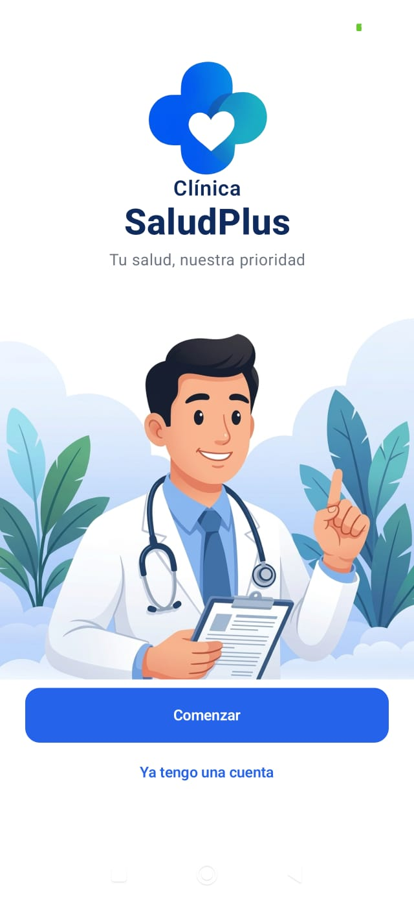
    </td>
    <td align="center" width="33%">
      <strong>2. Registro de paciente</strong><br>
      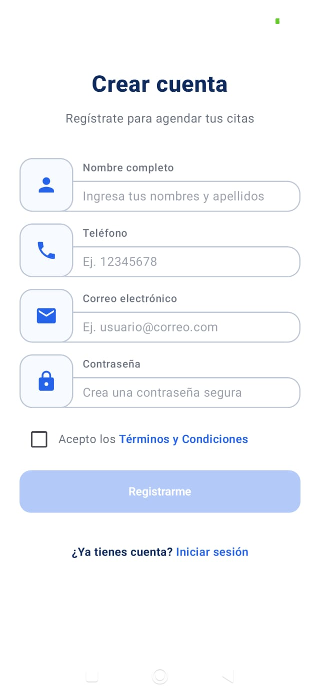
    </td>
    <td align="center" width="33%">
      <strong>3. Términos y condiciones</strong><br>
      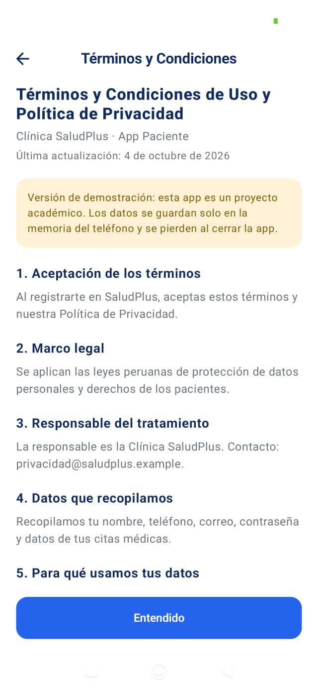
    </td>
  </tr>
  <tr>
    <td align="center">
      <strong>4. Inicio de sesión</strong><br>
      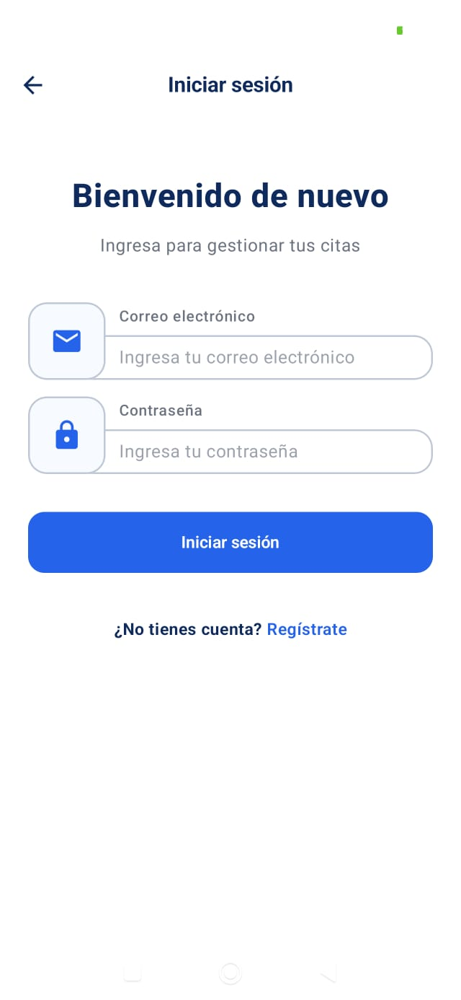
    </td>
    <td align="center">
      <strong>5. Pantalla principal</strong><br>
      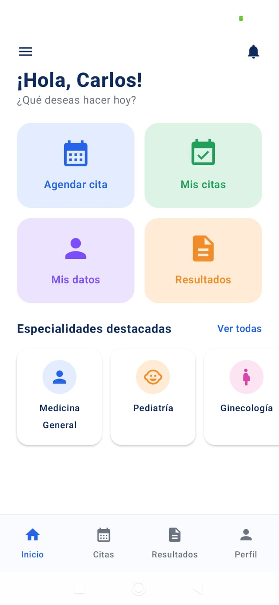
    </td>
    <td align="center">
      <strong>6. Especialidades médicas</strong><br>
      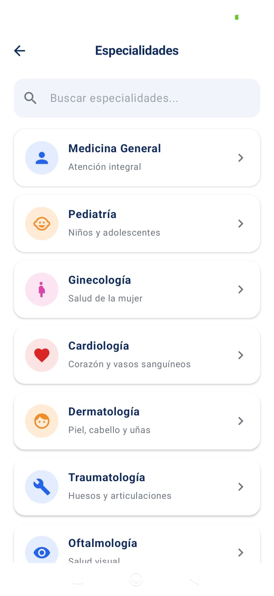
    </td>
  </tr>
  <tr>
    <td align="center">
      <strong>7. Listado de médicos</strong><br>
      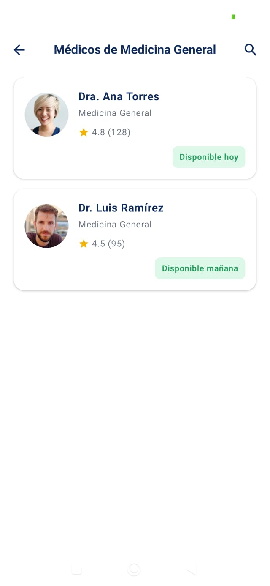
    </td>
    <td align="center">
      <strong>8. Selección de fecha y hora</strong><br>
      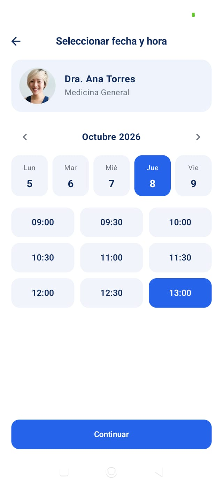
    </td>
    <td align="center">
      <strong>9. Confirmación de cita</strong><br>
      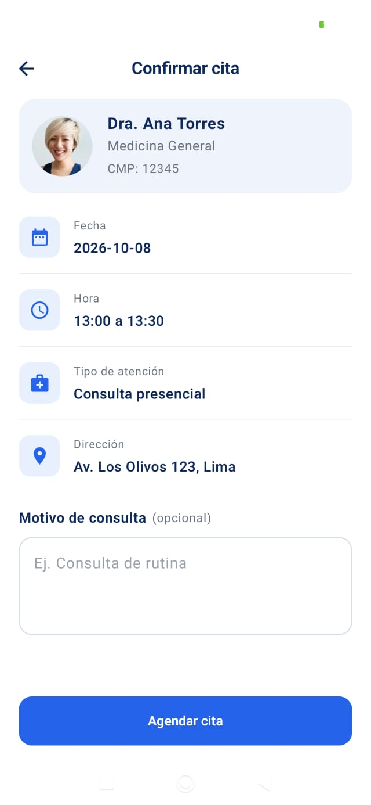
    </td>
  </tr>
  <tr>
    <td align="center">
      <strong>10. Cita agendada</strong><br>
      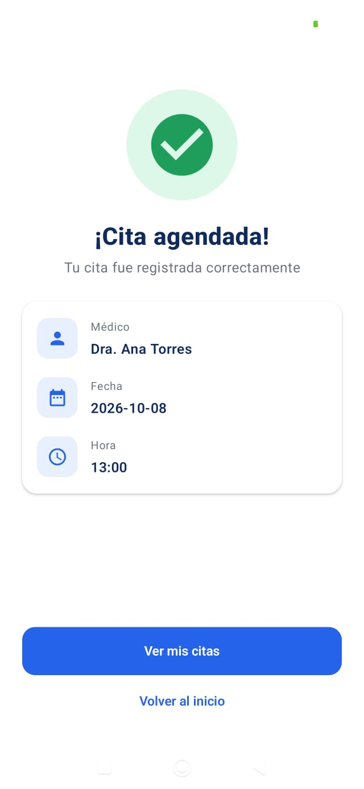
    </td>
    <td align="center">
      <strong>11. Historial de citas</strong><br>
      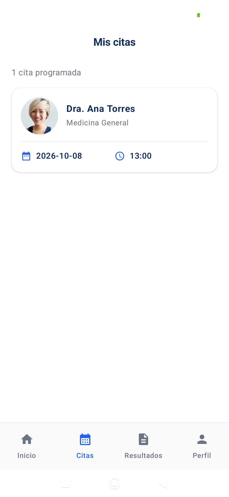
    </td>
    <td align="center">
      <strong>12. Historial vacío</strong><br>
      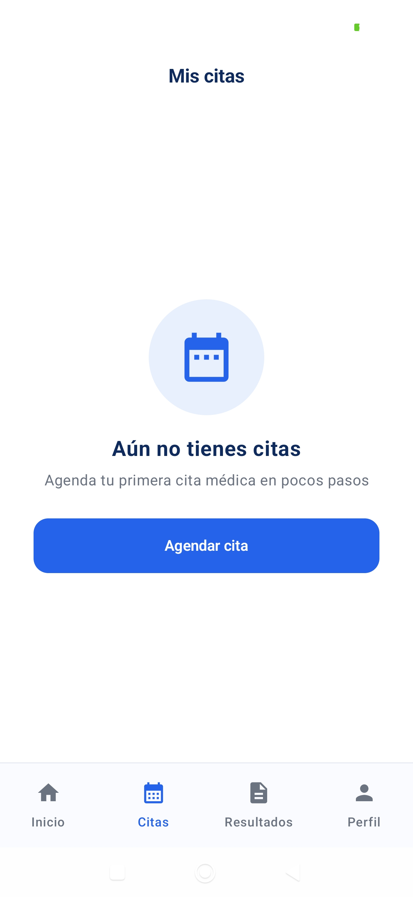
    </td>
  </tr>
  <tr>
    <td align="center">
      <strong>13. Detalle de cita</strong><br>
      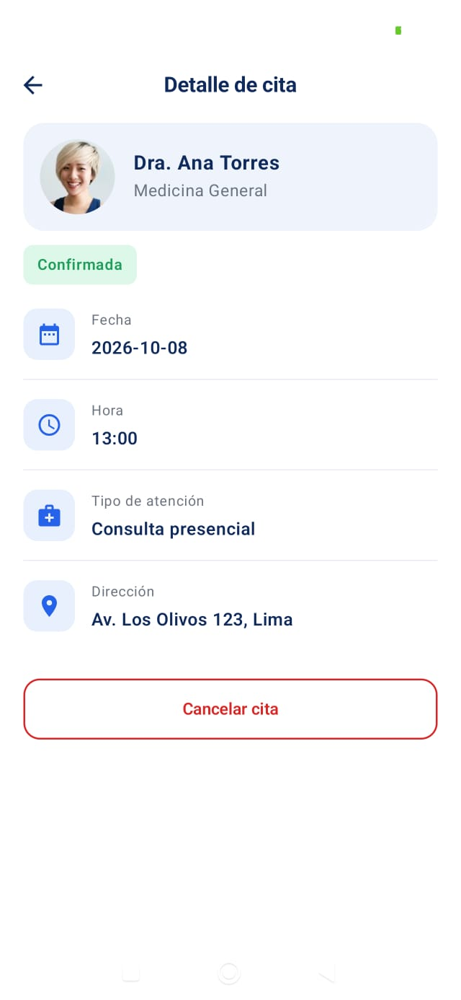
    </td>
    <td align="center">
      <strong>14. Perfil del paciente</strong><br>
      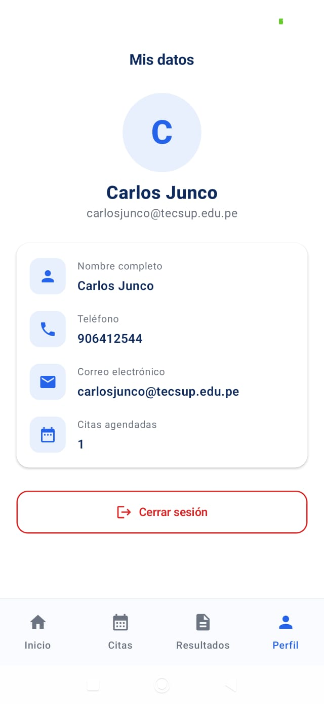
    </td>
    <td align="center">
      <strong>15. Resultados de exámenes</strong><br>
      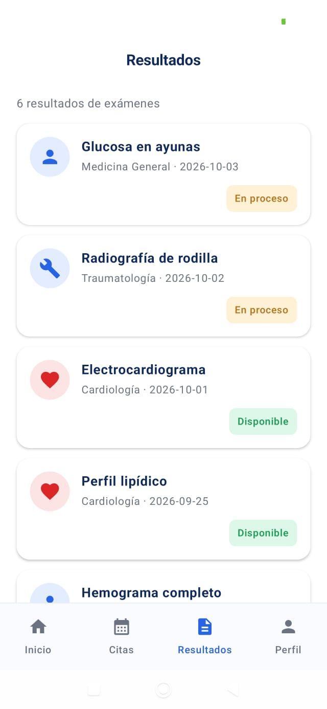
    </td>
  </tr>
  <tr>
    <td align="center" width="33%">
      <strong>16. Notificaciones</strong><br>
      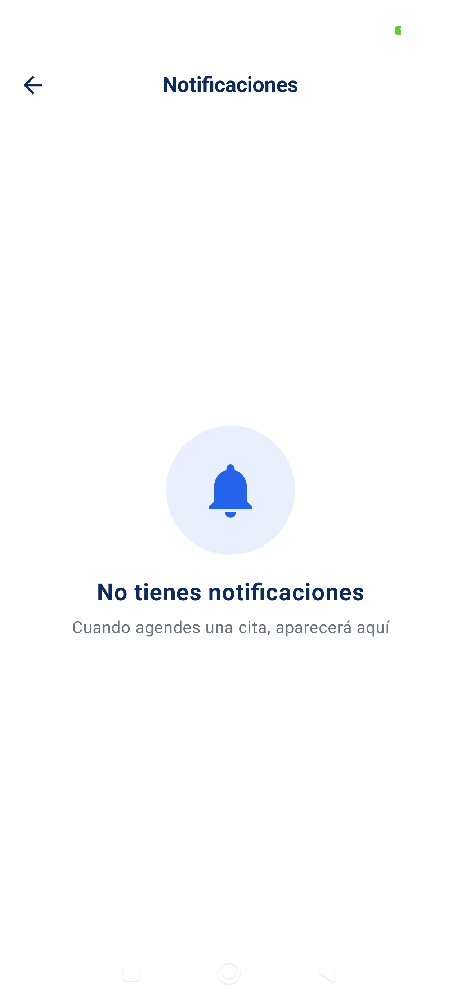
    </td>
    <td></td>
    <td></td>
  </tr>
</table>

### Capturas de la Fase 2 (mejora con-ia)

<table>
  <tr>
    <td align="center" width="33%">
      <strong>17. Búsqueda de médicos</strong><br>
      
    </td>
    <td align="center" width="33%">
      <strong>18. Médicos favoritos</strong><br>
      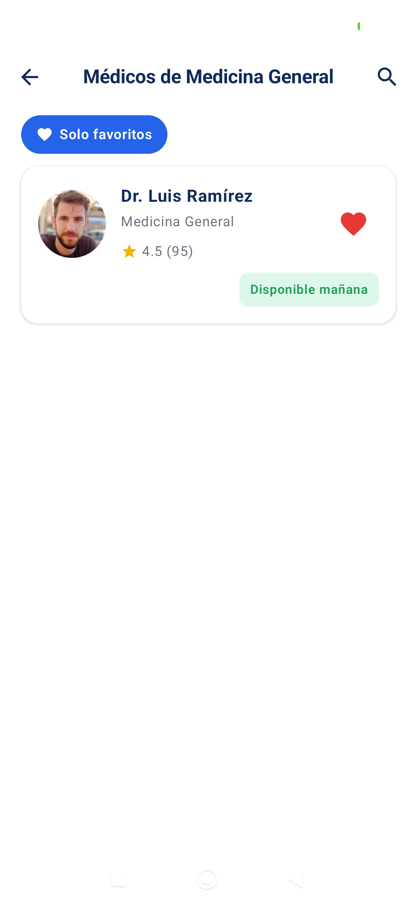
    </td>
    <td align="center" width="33%">
      <strong>19. Inicio con médicos favoritos</strong><br>
      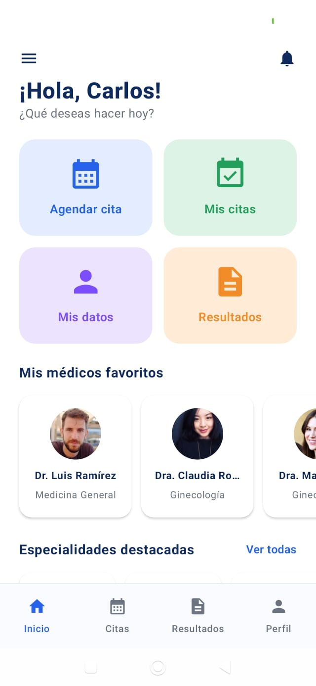
    </td>
  </tr>
  <tr>
    <td align="center" width="33%">
      <strong>20. Reprogramación de cita</strong><br>
      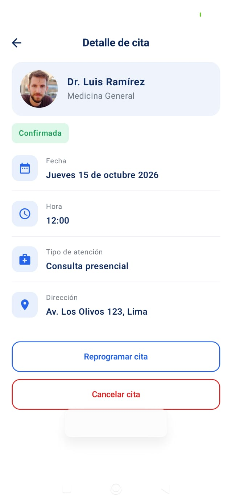
    </td>
    <td align="center" width="33%">
      <strong>21. Ayuda y preguntas frecuentes</strong><br>
      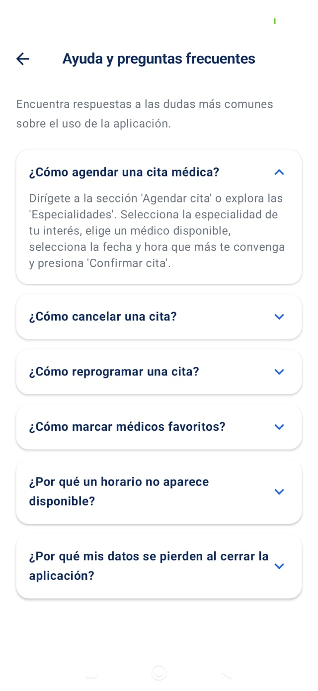
    </td>
    <td align="center" width="33%">
      <strong>22. Menú lateral interactivo</strong><br>
      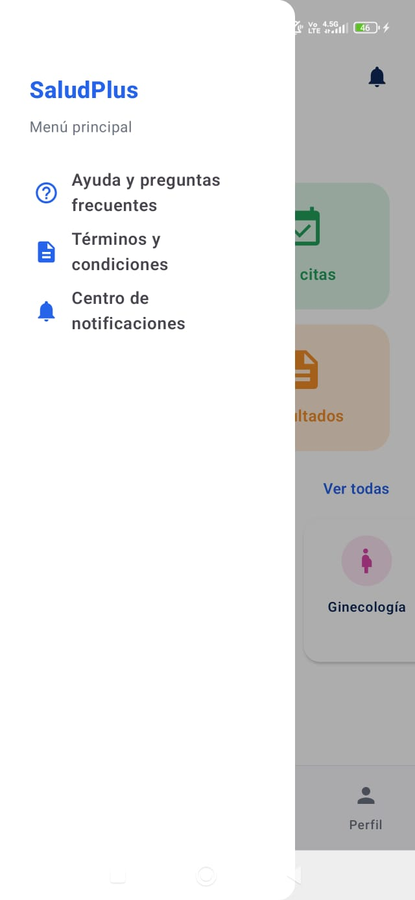
    </td>
  </tr>
</table>

## Flujo de navegación

```text
Splash
 ├── Registro
 │    └── Términos y condiciones
 └── Inicio de sesión
      └── Inicio
           ├── Especialidades
           │    └── Médicos
           │         └── Fecha y hora
           │              └── Confirmación
           │                   └── Cita agendada
           ├── Mis citas
           │    └── Detalle de cita
           ├── Resultados de exámenes
           ├── Perfil
           │    └── Cerrar sesión
           └── Notificaciones
```

## Consideraciones técnicas

- La aplicación está desarrollada para dispositivos Android.
- Las interfaces utilizan Jetpack Compose y Material 3.
- La navegación entre pantallas se gestiona mediante Navigation Compose.
- Los datos se almacenan temporalmente en memoria.
- La información no persiste al cerrar la aplicación.
- La carga de imágenes externas puede requerir conexión a internet.
- Los datos de ejemplo son demostrativos y no representan información real de una clínica.

## Conclusión

El desarrollo de Clínica SaludPlus permite aplicar conocimientos de programación móvil, diseño de interfaces y navegación entre pantallas. La aplicación reúne funcionalidades básicas para el registro de pacientes y la gestión de citas médicas, y constituye una base para futuras mejoras, como la integración de una base de datos y la autenticación persistente.

## Fase 2 (con-ia)

> **Nota de procedencia:** La Fase 2 se desarrolló con Gemini en Android Studio; los commits de la Fase 1 conservan sus autores originales.

En la Fase 2 se implementaron mejoras clave utilizando IA para elevar la funcionalidad y experiencia de usuario de la aplicación.

### Mejoras implementadas

1. **Soporte de API y Utilidades de Fechas:**
   - Se actualizó el `minSdk` a 26 en `build.gradle.kts`.
   - Se crearon utilidades de fecha (`util/Fechas.kt`) basadas en `java.time.LocalDate` para cálculo de días hábiles, nombres de días, meses y formateo en español ("Martes 6 de setiembre 2026").
2. **Calendario Dinámico:**
   - Integración de un selector interactivo de fechas en la pantalla de Fecha y hora con navegación por semanas hábiles, marcas del día actual ("Hoy"), animaciones en el cambio de semanas y recálculo automático de horarios.
3. **Formateo de Fechas en Español:**
   - Presentación de fechas en lenguaje natural y en español en los módulos de confirmación y detalle de citas.
4. **Médicos Favoritos:**
   - Selección y persistencia en memoria de médicos favoritos por usuario (`SnapshotStateMap`).
   - Botón de corazón interactivo, chip de filtrado en el listado de médicos y carrusel rápido en la pantalla de inicio.
5. **Búsqueda Dinámica de Médicos:**
   - Búsqueda por nombre directamente desde la pantalla de Especialidades a partir de 2 caracteres.
6. **Prevención de Citas Solapadas:**
   - Verificación de disponibilidad horaria del paciente para evitar reservas duplicadas en el mismo horario.
7. **Reprogramación de Citas:**
   - Reutilización del selector de fecha y hora (`SelectorFechaHora.kt`) para reprogramar citas existentes conservando el ID y liberando el turno anterior.
8. **Centro de Ayuda y Preguntas Frecuentes:**
   - Pantalla interactiva con acordeón (`AnimatedVisibility`) y rotación de íconos para resolver dudas comunes de la aplicación.
9. **Menú Hamburguesa Lateral Interactivo:**
   - Integración de `ModalNavigationDrawer` deslizable en la pantalla principal para acceder rápidamente a Ayuda, Términos y Notificaciones.

### Limitaciones conocidas

- Todos los datos nuevos (favoritos, reprogramaciones y citas solapadas) viven temporalmente en el objeto `Repositorio` en memoria y no persisten al cerrar o reiniciar la aplicación.

### Historial de commits de la Fase 2 (`con-ia`)

```text
f71a3e9 | Carlos Junco | carlos.junco@tecsup.edu.pe | Agregar funcionalidad al menu hamburguesa lateral en Inicio
5bad8fc | Carlos Junco | carlos.junco@tecsup.edu.pe | Agregar la pantalla de Ayuda y Preguntas Frecuentes
4f61d7e | Carlos Junco | carlos.junco@tecsup.edu.pe | Implementar la reprogramacion de citas y extraer SelectorFechaHora
2becaef | Carlos Junco | carlos.junco@tecsup.edu.pe | Evitar el agendamiento de citas solapadas para el mismo paciente
464035f | Carlos Junco | carlos.junco@tecsup.edu.pe | Permitir busqueda de medicos por nombre desde la pantalla de Especialidades
8bc65e9 | Carlos Junco | carlos.junco@tecsup.edu.pe | Implementar seleccion y visualizacion de medicos favoritos por usuario
e677086 | Carlos Junco | carlos.junco@tecsup.edu.pe | Formatear fechas en texto en espanol en la confirmacion y detalle de cita
efe602d | Carlos Junco | carlos.junco@tecsup.edu.pe | Implementar calendario dinamico en la seleccion de fecha y hora
d070cdf | Carlos Junco | carlos.junco@tecsup.edu.pe | Crear utilidades de fechas con LocalDate para gestion del calendario
70b4b78 | Carlos Junco | carlos.junco@tecsup.edu.pe | Actualizar minSdk a nivel 26 para soporte nativo de LocalDate
```

## Información académica

**Autor:** Carlos Junco  
**Curso:** Programación en Móviles  
**Proyecto:** Clínica SaludPlus — App Paciente  
**Repositorio:** [GitHub - Moviles_Android_D](https://github.com/carlosjunco2025/Moviles_Android_D)

