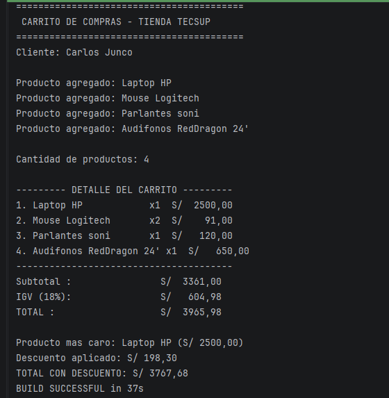

# Lab 02: Carrito de Compras en Kotlin

**Alumno:** Carlos Junco  
**Curso:** Desarrollo de Aplicaciones Mobile

---

## ¿De qué trata el proyecto?
En este laboratorio armé un programa en consola que simula un carrito de compras. La idea principal fue trabajar con POO, listas mutables y delegar toda la lógica en funciones específicas para calcular precios, impuestos, descuentos y darle un formato ordenado al reporte de compra.

### Funciones que implementé
* `calcularSubtotal`: Recorre los productos del carrito y suma sus importes totales (precio × cantidad).
* `calcularIGV`: Le saca el 18% al subtotal acumulado.
* `calcularTotal`: Suma el subtotal con el IGV para sacar el precio bruto.
* `mostrarDetalle`: Imprime en pantalla la lista de productos bien alineada por columnas usando `String.format`.
* `calcularDescuento`: Evalúa con un `when` si el total supera los S/ 3000 (5%) o S/ 5000 (10%) para aplicar la rebaja.
* `maxByOrNull`: Busca directamente en la lista cuál es el producto que tiene el precio más alto.

---

## Respuestas a las preguntas de análisis (Parte 2)

1. **¿Por qué `nombre` y `precio` son `val` pero `cantidad` es `var`?**  
   Porque el nombre y el precio vienen fijos desde el catálogo de la tienda y no deberían cambiarse a mitad de una compra (`val`). Sin embargo, la `cantidad` sí necesita ser variable (`var`) porque el cliente tiene que poder aumentar o quitar unidades de su carrito antes de pagar.

2. **¿Qué pasaría si intentas cambiar el precio después de crear el producto?**  
   Kotlin no te deja ni compilar el proyecto. Salta el error `Val cannot be reassigned` porque las propiedades declaradas como `val` son solo de lectura y su valor no se puede reasignar.

