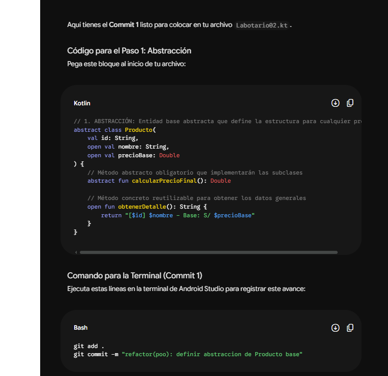
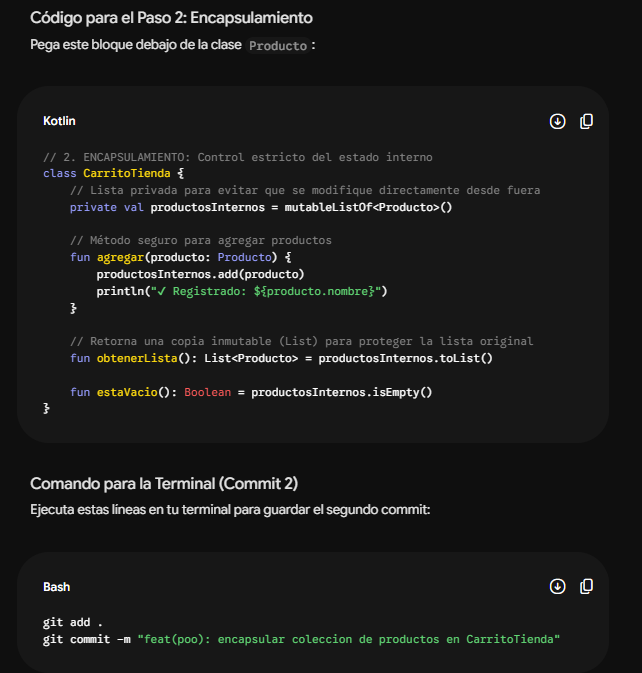
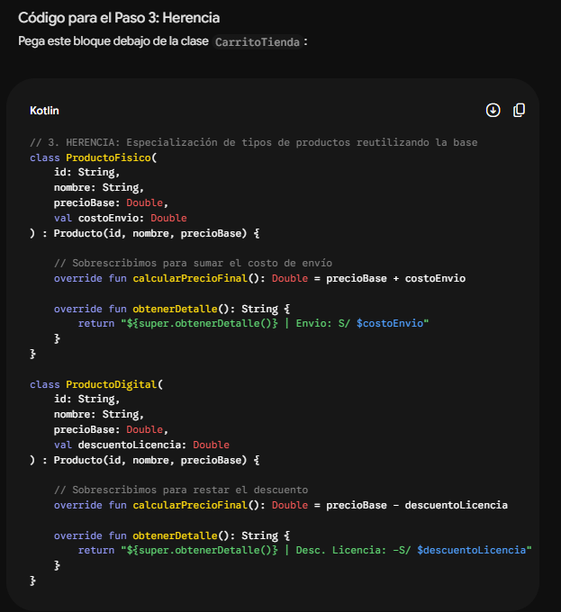
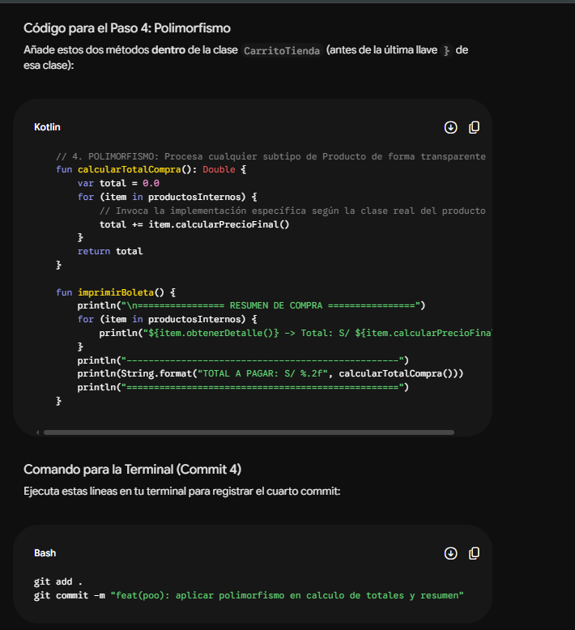
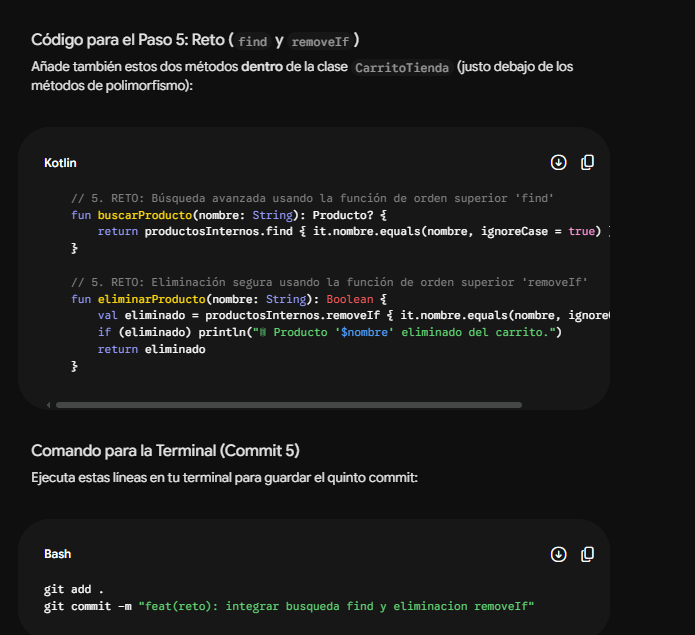
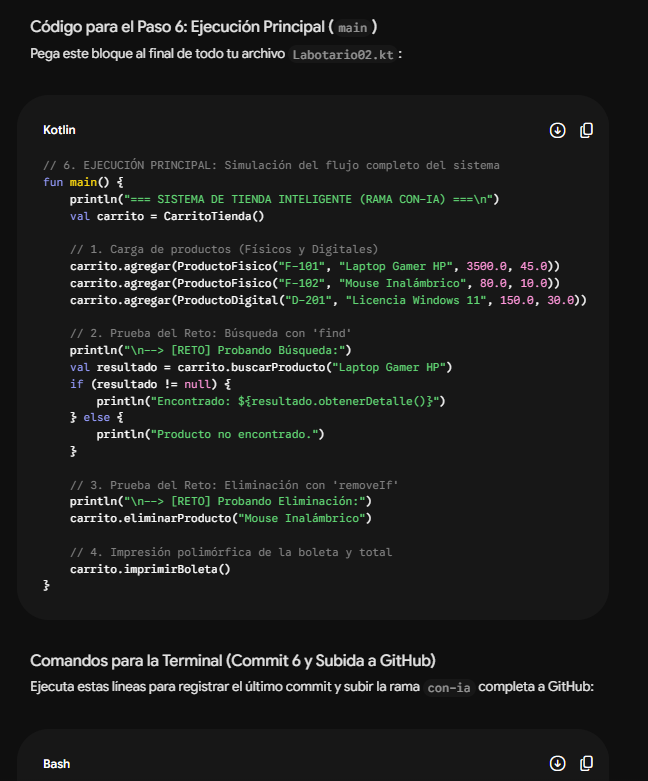

## inicio del chat con la ia##
Hola IA, necesito desarrollar la solución del Laboratorio 02 sobre un sistema de Carrito de Compras en Kotlin. La idea es estructurarlo usando POO avanzada y cumplir con un requerimiento de exactamente 6 commits , es un trabajo super importante , quiero q tambien me espesificques tambien cada procedieminto que hacemos en el trayecto 

"Mi chat"
iniciemos "Genera la clase base abstracta Producto con propiedades de id, nombre, precioBase y el método abstracto calcularPrecioFinal()

"Respuesta de la ia"

"Mi chat"
Crea la clase CarritoTienda protegiendo la lista interna de productos para que no sea modificada directamente desde fuera

"Respuesta de la ia"

"Mi chat"
Implementa dos subclases que hereden de Producto: ProductoFisico (con costo de envío) y ProductoDigital (con descuento de licencia

"Respuesta de la ia"

"Mi chat"
Añade métodos en CarritoTienda que procesen cualquier subtipo de Producto de forma transparente al calcular totales e imprimir el resumen

"Respuesta de la ia"

"Mi chat"
Integra en la clase CarritoTienda la búsqueda avanzada por nombre usando find y la eliminación segura mediante removeIf

"Respuesta de la ia"

"Mi chat"
Escribe la función main() para simular el flujo completo de la tienda, probar búsquedas, bajas e imprimir el desglose final

"Respuesta de la ia"

Conclusiones y Aprendizajes

- **Aplicación Práctica de POO:** Se consolidaron los 4 pilares fundamentales (Abstracción, Encapsulamiento, Herencia y Polimorfismo) para construir un software escalable y mantenible.
- **Uso Eficiente de Kotlin:** Implementación de funciones de orden superior (find y removeIf) para simplificar la manipulación de colecciones.
- **Flujo de Trabajo Profesional con Git:** Gestión disciplinada de cambios mediante commits semánticos en una rama dedicada con-ia.

---

## Estado del Proyecto
- **Rama:** con-ia
- **Estado:** Completado y verificado en la terminal de Android Studio.
- **Commits totales:** 6/6 creados y subidos al repositorio remoto.